# mandelbr8

A fast Mandelbrot generator for 8-bit computers, written in 100% assembly.

This is a fork of the original
[`mandelbr8`](https://github.com/0x444454/mandelbr8) by `0x444454`.
See [Attribution](#attribution).

## What's new in this fork

- 40-pixel stripe Mariani-Silver rendering on C64: 27 % faster
  multicolor, 33 % faster contour.
- 320×200 monochrome contour mode for C64 (separate binary).
- Edge-triggered input: one press, one action. Pan and zoom work
  reliably under VICE warp mode.
- Pan and zoom step sizes raised to ~4 % and ~8 % per press.
- Vertical centering fixes for C64, C128 VIC-IIe, and C128 VDC.
- Luma-ordered palettes for C64, C128, TED, and VIC-20.

## Quick start

1. Download a binary from the [`release/`](release/) folder for your
   machine.
2. Load and run it the usual way:
   ```
   LOAD"*",8,1
   RUN
   ```
3. Use a joystick to pan and zoom. See [Controls](#controls).
4. In [VICE](https://vice-emu.sourceforge.io/), turn on warp mode to
   shorten render times.

## Supported machines

| Target          | Notes                                                          |
|-----------------|----------------------------------------------------------------|
| Commodore 64    | Multicolor and contour modes; optional Kawari acceleration     |
| Commodore 128   | VIC-IIe (40-col) and VDC (80-col) modes                        |
| Plus/4 / C16    | TED chip; 64 KB required                                       |
| VIC-20          | 16 KB memory expansion required (Block 1 + Block 2 minimum)    |
| PET             | 8 KB+ RAM; optional color support                              |
| CBM-II (B128)   | 6xx and 7xx series                                             |
| Atari XL/XE     | 64 KB; uses GTIA 16-luma mode                                  |
| BBC Micro B     | 32 KB                                                          |

## Controls

| Target          | Joystick port / input                              |
|-----------------|----------------------------------------------------|
| C64 / C128      | Port 2                                             |
| Plus/4 / C16    | Port 1                                             |
| VIC-20          | Port 1                                             |
| Atari XL/XE     | Port 1                                             |
| PET / CBM-II    | WASD for directions, SHIFT for fire                |
| BBC Micro       | Analog port 1, or cursor keys + Shift              |

| Input               | Effect                                       |
|---------------------|----------------------------------------------|
| Direction (no fire) | Pan view (~4 % per press)                    |
| Fire + Up           | Zoom in (~8 % per press)                     |
| Fire + Down         | Zoom out                                     |
| Fire + Right        | Increment max iterations (cap 255)           |
| Fire + Left         | Decrement max iterations (floor 2)           |

Each press triggers one action. Zoom saturates at the precision floor,
about 12× from the default view.

## Screenshots

### C64 multicolor (160×200, 16 colors, luma-ordered palette)

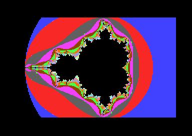
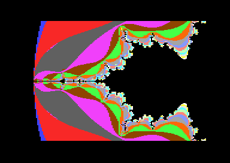

### C64 contour (320×200 monochrome)

Default `max_iter = 32` gives 16 contour bands.

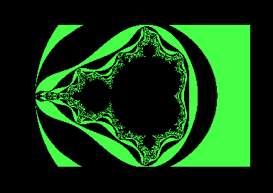
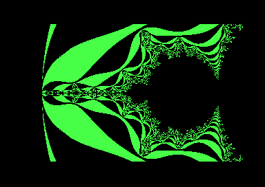

### C128 VDC (160×100 in 80-column mode)

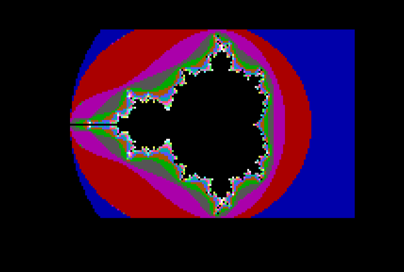
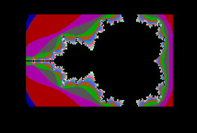

### Plus/4 (TED, 160×200, uniform-luma palette)

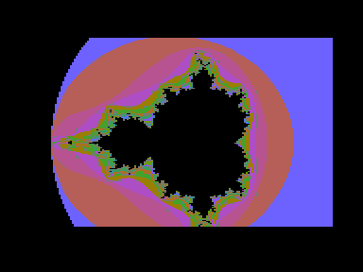

### VIC-20 (88×176, 4 fixed colors)

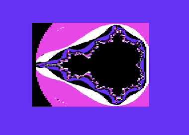

### PET (40×25 text, color)

PET has no bitmap mode; the renderer uses PETSCII glyphs for shading.

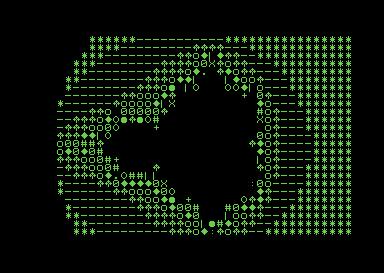

### CBM-II / B128 (80×25 text)

CBM-II uses an 80-column text-mode render with PETSCII shading.

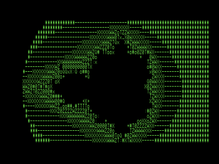

### Deep zoom (C64 with SuperCPU, raised `max_iter`)

A SuperCPU lifts the per-iteration cost enough that very deep zooms
become practical. With `max_iter` raised via Fire+Right, more iter
bands appear and fine fractal detail at the precision floor stays
visible.

| Multicolor | Contour |
|---|---|
| 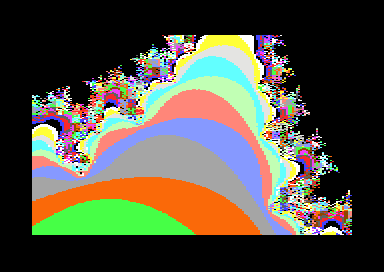 | 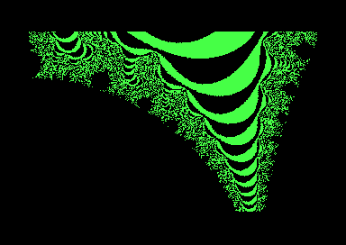 |

## Resolutions

| Target                       | Lo-res preview        | Hi-res render                                    |
|------------------------------|-----------------------|--------------------------------------------------|
| C64 / C128 40-col / Plus/4   | 40×25, 16 colors      | 160×200, 16 colors (multicolor bitmap)           |
| C64 contour                  | (skipped)             | 320×200 monochrome                               |
| C128 80-col (VDC)            | 80×50, 16 colors      | 160×100, 16 colors (64 KB VDC RAM required)      |
| VIC-20                       | 22×22, 16 colors      | 88×176, 4 colors (multicolor bitmap)             |
| PET                          | 40×25 mono / 16-color | not supported                                    |
| CBM-II                       | 80×25 mono            | not supported                                    |
| Atari XL/XE                  | 40×25, 16 grey shades | 80×200, 16 grey shades (ANTIC F.1)               |
| BBC Micro                    | 40×32, 8 colors       | 160×256, 8 colors                                |

## Running in VICE

Turn on warp mode to shorten render times. VICE emulates faster than
real time without changing the result, and the input handler stays
accurate.

VICE shortcut: Alt+W (macOS) or Page Up (Windows / Linux). Or
Speed → Warp mode in the menu.

## Build from source

Built with [64TASS](https://sourceforge.net/projects/tass64/) (≥ 1.59).
On macOS: `brew install 64tass`.

The target machine is selected by the `BUILD_*` flags at the top of
`src/6502/mandelbr8.asm`. Exactly one must be `1`.

```bash
# C64 multicolor (default)
64tass -o build/c64.prg -a src/6502/mandelbr8.asm

# C64 contour (set BUILD_HIRES_CONTOUR = 1 in source first)
64tass -o build/c64-contour.prg -a src/6502/mandelbr8.asm

# C128, Plus/4, VIC-20, PET, CBM-II  (toggle the matching BUILD_* flag)
64tass -o build/c128.prg  -a src/6502/mandelbr8.asm
64tass -o build/ted.prg   -a src/6502/mandelbr8.asm
64tass -o build/vic20.prg -a src/6502/mandelbr8.asm
64tass -o build/pet.prg   -a src/6502/mandelbr8.asm
64tass -o build/cbm2.prg  -a src/6502/mandelbr8.asm

# Atari XL/XE
64tass --output-exec=main --atari-xex \
       -o build/atari.xex -a src/6502/mandelbr8.asm

# BBC Micro B (bootable SSD)
64tass -b -o build/beeb.ssd -a src/6502/mandelbr8.asm
```

Tunable build options at the top of `src/6502/mandelbr8.asm`:
`BUILD_HIRES_CONTOUR`, `BUILD_MARIANI_SILVER_STRIPE`, `BUILD_LUMA_PALETTE`,
`BUILD_BENCHMARK`, `BUILD_PERIODICITY`.

## Technical details

### Mandelbrot iteration

Each iteration:

```
zx, zy ← zx + cx, zy + cy
zx², zy² ← zx·zx, zy·zy
if zx² + zy² ≥ 4: diverged, stop
zx, zy ← zx² − zy², 2·zx·zy
```

Most 8-bit CPUs have no integer multiply, which makes naive
implementations slow. This algorithm uses Q5.11 fixed-point arithmetic
(5-bit signed integer part, 11-bit fraction; range [−16, +16)) with a
fast 16×16 signed multiply. The trade-off is a limited zoom range:
the precision floor is reached around 12× from the default view.

If the machine has at least 64 KB RAM, a 32 KB lookup table of squared
Q4.10 values is built at startup. This eliminates two of the three
multiplies per iteration, leaving only `2·zx·zy` to compute via
`smult12` (Toby Lobster's quarter-square multiply, ~234 cycles).

If a Kawari VIC-II replacement is detected on C64, hardware
multiplication via `$D02F–$D033` registers is used, saving ~25 % of
total render time.

### Q5.11 precision

The Mandelbrot set fits inside a circle of radius 2, but iteration can
produce intermediate magnitudes that exceed it. Q5.11 balances density
against headroom for those intermediates.


### Rendering passes

Most targets render in two passes:

1. Lo-res preview at e.g. 40×25 (one Mandelbrot point per cell).
   Cardioid and period-2-bulb fast tests skip the iteration loop for
   points known to be inside the set.
2. Hi-res at full resolution. C64 uses stripe-wise Mariani-Silver
   border tracing; other targets render row by row.

### Stripe-wise Mariani-Silver (C64)

The hi-res image is built in 40-pixel stripes (10 multicolor cells or
5 contour tiles per stripe). For each stripe:

1. Border trace: compute the 92 perimeter samples (top + bottom rows
   plus 6 interior pixels of each side column).
2. Recursive subdivision: pop a sub-rectangle from a stack. If its
   border samples are uniform, fill the interior with that iter
   without further computation. Otherwise split at the midpoint,
   compute the 6 pixels of the split column, and push the two halves.
3. Sub-rectangles narrower than 6 pixels are brute-forced.

Default-view measurements on stock C64 (PAL):

- Multicolor: 102 s with stripe MS, 140 s without.
- Contour: 175 s with stripe MS, 261 s without.

### Color clash

VIC-II 4×8 multicolor blocks support 4 colors:

- 1 shared background (black, used for the in-set Mandelbrot region).
- 3 per-tile colors from the 16-color palette.

A histogram of each tile's iter values selects the 3 most common as
that tile's per-tile colors. Some artifacts can remain depending on
tile location in the complex plane.

`BUILD_LUMA_PALETTE` (default-on) reorders the palette so adjacent
iter values map to perceptually adjacent luminance. The same flag
also gives:

- C128 VDC: a luma-ordered 16-color palette mapped to the VDC
  CGA-style colors.
- TED (Plus/4 / C16): a uniform-luma palette. TED multicolor allows
  only 2 cell-specific colors per 4×8 cell, so any luma variation
  between cells creates visible stepping. Tunable via `TED_HI_LUMA`
  in the source.
- VIC-20: the 4 fixed multicolor slots reordered as
  black → blue → purple → white.

## License

Creative Commons Attribution 4.0 International (CC BY 4.0).

<https://creativecommons.org/licenses/by/4.0/>

## Attribution

This project is based on / adapted from `mandelbr8`, originally created
by GitHub user `0x444454`.

Original repository:
<https://github.com/0x444454/mandelbr8>

The original repository appears to be no longer available on GitHub.
The original project was licensed under Creative Commons Attribution
(CC BY). This version contains modifications by Janne Tompuri /
[`jtompuri`](https://github.com/jtompuri).
